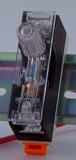

- 安全保护  
  - 熔断器
  

# 安全保护

1、熔断器

功能：  
连接在电路上用以保护电路的即弃元件，电路电流过大时，其中的金属线或片产生高温而熔断，开路中断电流，保护电路免于伤害。保险丝熔断后须人手更换以使电路恢复运行

[推荐购买链接](https://detail.tmall.com/item.htm?ali_refid=a3_430673_1006:1109458602:N:zI2MGtEtek31Fx6rBAkTHbXzr4koNIEE:f88e5d4d25fb2e09f223f1ab944208e7&ali_trackid=1_f88e5d4d25fb2e09f223f1ab944208e7&id=39433280198&skuId=4176723770539&spm=a2e0b.20350158.31919782.4)

