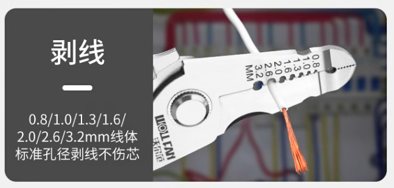
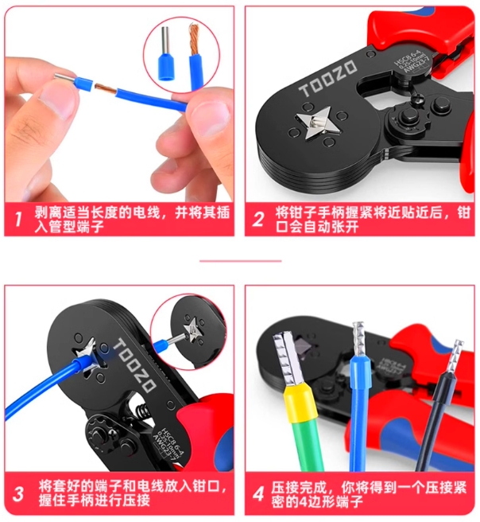
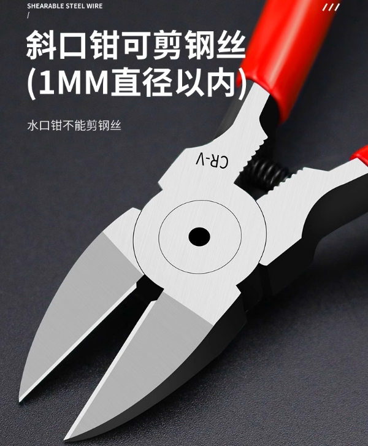

# 电气工具清单

|  序号   |  工具名   |  图片   |  功能   |
| :-: | :-: | :-: | :-: |
|   1  |  剥线钳   |     |  拨开线保护层，裸露线芯   |
|   2  |  管型端子压线钳   |     | 制作接线端子    |
|   3  |  斜口钳   |     | 剪硬性材料    |
|   4  |     |     |     |
|   5  |     |     |     |
|   6  |     |     |     |