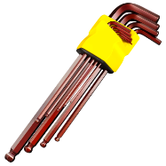

# 机械工具清单

<!--  -->

|  序号   |  工具名   |  图片   |  功能   |
| :-: | :-: | :-: | :-: |
|   1  |  内六角扳手   |     |  拆装内六角螺丝   |
|   2  |  活动扳手   |     |     |
|   3  |  卷尺   |     |     |
|   4  |  美工刀   |     |     |
|   5  |  一字螺丝刀   |     |     |
|   6  |  十字螺丝刀   |     |     |

每一个工具的描述