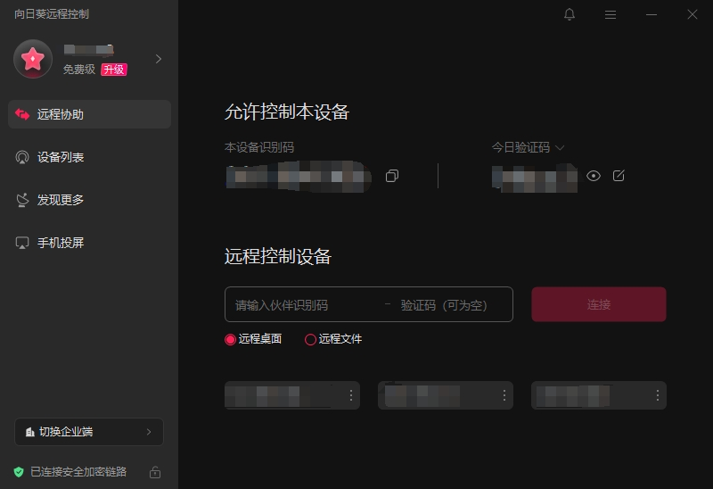
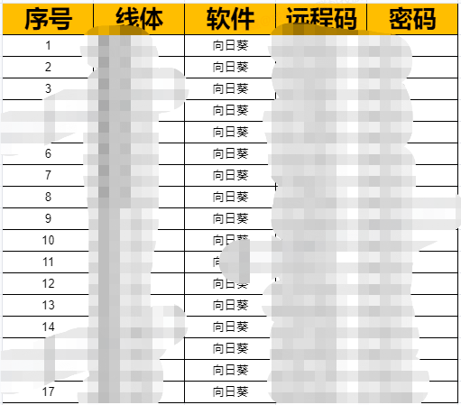

- [背景描述](#背景描述)
- [常用工具](#常用工具)
- [通信管理](#通信管理)

# 背景描述

实际项目中，现场设备运行出现了异常，在现场有网络条件的情况下，常需要公司工程师远程进行排查问题，项目、设备、人就会有多对多的关系，为了提高大家沟通的效率，需要有信息中心，来存储大家远程的接口信息

# 常用工具

1、移动 wifi  

通常是购买流量包月到餐，到期后进行续费，项目中网速还行

2、向日葵  

[下载链接](https://sunlogin.oray.com/)，项目中向日葵验证码通常设置为固定密码

# 通信管理

团队内部，通常用企业微信的在线表格，实现多人共享

