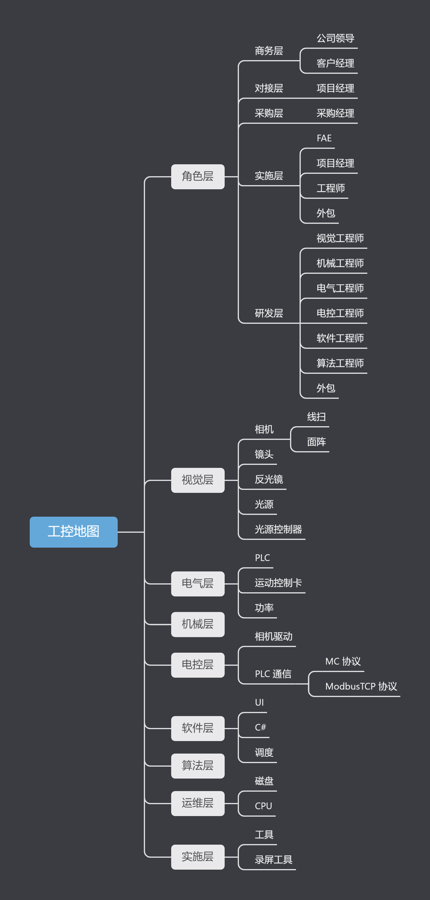

# IndustrialControl
工控行业的点点滴滴

|                       视觉                        |                       机械                        |                       电气                        |                       电控                        |                       软件                        |                       算法                        |                       实施                        |                       运维                        |
| :-----------------------------------------------: | :-----------------------------------------------: | :-----------------------------------------------: | :-----------------------------------------------: | :-----------------------------------------------: | :-----------------------------------------------: | :-----------------------------------------------: | :-----------------------------------------------: |
|  |  |  |  |  |  |  |  |

# 工控地图

# 视觉

# 机械

# 电气

# 电控

# 软件

# 算法

# 实施

# 运维

