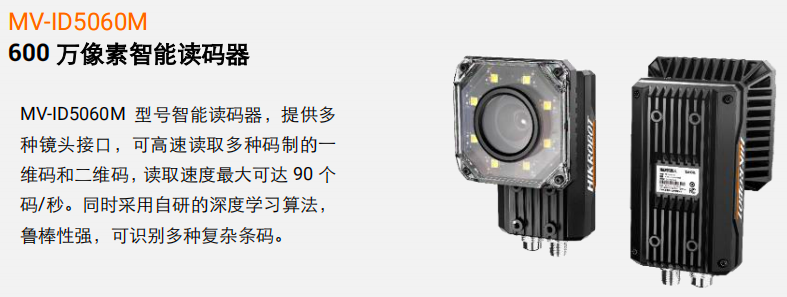
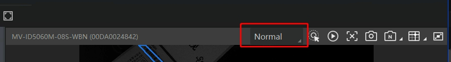
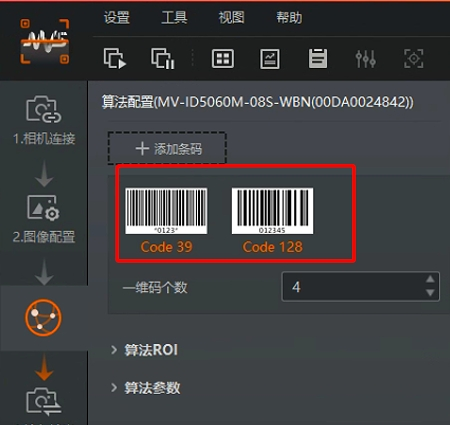
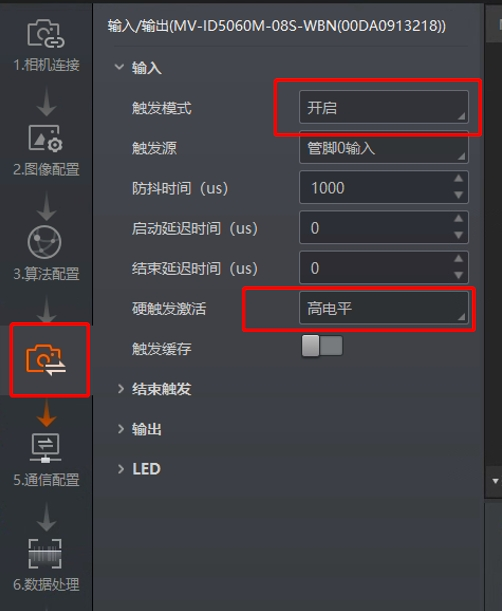
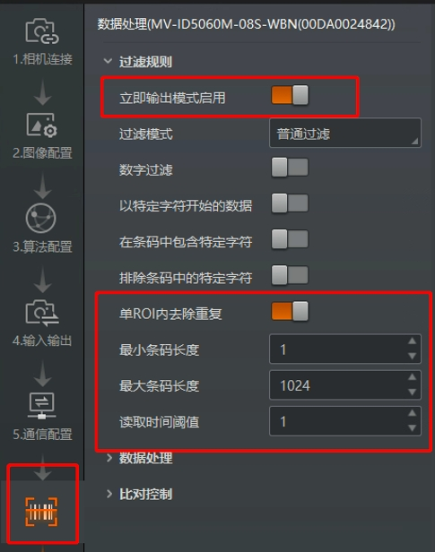
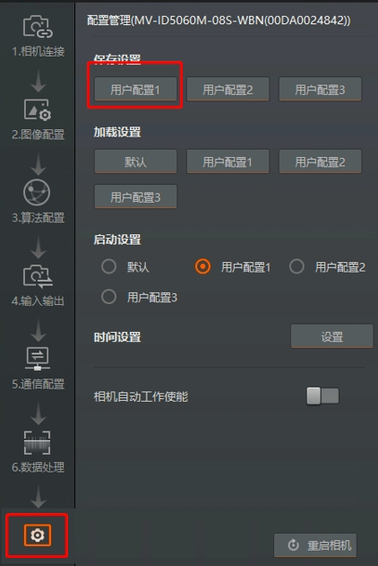

- [扫码枪功能](#扫码枪功能)
- [海康扫码枪](#海康扫码枪)

# 扫码枪功能

条码识别是工业中常见的业务应用，识别后的条码字符串常用作物料的唯一 ID，作为存图名、多系统交互的标志

# 海康扫码枪

- MV-ID5060M-08S-WBN 24V 23W

    

IDMVS 硬触发参数

1、设置触发模式

    

2、添加条码类型

    

3、设置触发参数

    

4、设置过滤规则

    

5、保存用户配置

    

官方手册下载链接：
链接：https://pan.baidu.com/s/1y2-cKTI7Sm4BVgvUlavlDA 提取码：1234 

注意事项：

1、自动聚焦后，曝光参数要调小，防止运动的物体扫码拖影（示例值：曝光参数 = 500 ms，增益 = 30）
